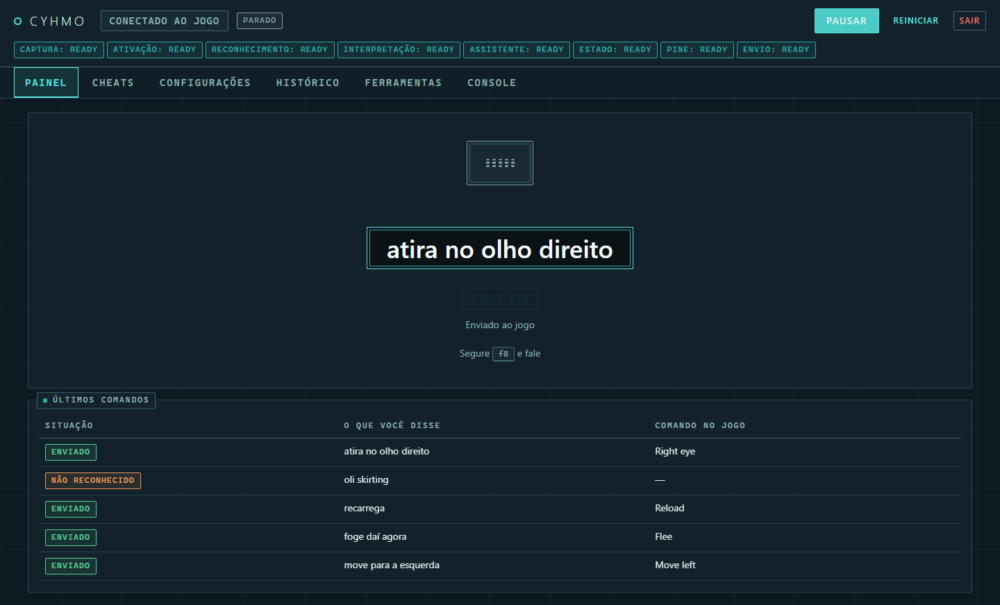

<div align="center">

# CYHMO

*Can you hear me, operator?*

[Português](README.md) · **English**


[](https://pcsx2.net/)

[](LICENSE)
[](https://github.com/SamuelsonPajeu/CYHMO/releases)



</div>

**Lifeline** (*Operator's Side*, PS2, 2003) is played entirely by voice: you speak and Rio
obeys. The original recognizer only understands English, gets it wrong a lot, and is the
reason the game is known as unplayable.

CYHMO swaps that recognizer for a modern one. You speak **in your own language**, the mod
transcribes on your machine, works out which game command matches what you said and writes
that command into the emulator's memory.

The vocabulary is not a fixed list: on every scene change the mod reads, from the game's
memory, the commands **that scene** accepts.

---

## Before you start

| | |
|---|---|
| System | Windows 10 or 11 |
| Emulator | [PCSX2](https://pcsx2.net/) (2.6.3) |
| Game | **your own copy** of Lifeline **NTSC-U** (serial `SLUS-20848`) — other regions do not work |
| Microphone | |

**Set up PCSX2:**

1. `Tools → Show Advanced Settings` → enable the option and confirm the dialog.
2. `Settings → Advanced → PINE Settings` → check **Enable**, leave the slot at **28011**.
3. `Settings → Controller → USB Port 1` → assign a microphone to Player 1 to enable the game's native recognition.

---

## Hardware

By default recognition runs on the **CPU**.

| | Minimum | Recommended |
|---|---|---|
| CPU | 4 recent cores / 8 threads | 8 cores |
| RAM | 8 GB | 16 GB |
| Disk | 4 GB free | 6 GB free, on an SSD |
| Graphics card | - | - |

**Backends**

In my own testing whisper.cpp came out ahead, with lower latency.

* whisper.cpp — **default**
* faster-whisper

### LLM assistant

The assistant is **optional and off by default**. It only runs when recognition is in doubt,
and it runs locally through Ollama. It adds to these requirements:

| | Minimum | Recommended |
|---|---|---|
| Model | `qwen2.5:1.5b` (~1 GB) | `qwen2.5:3b` (~2 GB) |
| Free VRAM | ~6 GB in total | 8 GB or more |
| RAM | 16 GB | 32 GB, if the model runs on the CPU |

Measured cost per command: **~25 ms** on the GPU and **~215 ms** on the CPU. Without a GPU the
assistant is still usable, but it eats a fifth of the latency budget.

> **Warning:** these requirements do not account for the resources the game itself uses
> while running through the emulator.

---

## Installation

Requires **Python 3.11+** installed: [Python](https://www.python.org/downloads/) | [uv](https://docs.astral.sh/uv/getting-started/installation/).

Download `CYHMO_portable.zip` from
[Releases](https://github.com/SamuelsonPajeu/CYHMO/releases), extract the files into a folder and
run **`CYHMO.cmd`**. On the first run it downloads the dependencies and takes a few minutes.

Or

<details>
<summary>Clone the project</summary>

<br>

```powershell
git clone https://github.com/SamuelsonPajeu/CYHMO.git
cd CYHMO
.\install.ps1
.\.venv\Scripts\python.exe -m cyhmo run
```

</details>

---

## Playing

1. Open PCSX2 and load the game (the order does not matter; the mod waits for the emulator).
2. Open CYHMO. It serves the interface at <http://127.0.0.1:8765> and opens the browser.
3. **Hold right <kbd>Ctrl</kbd>, say the command, release.**

The **Cheats** tab lists
everything the current scene accepts. Clicking an item sends that command straight to the game.

**If something does not work,** open a terminal in the CYHMO folder and run the diagnosis: it
checks the environment, the emulator, the game, the microphone and the models.

```powershell
.\CYHMO.cmd doctor
```

---

## Trouble with the tutorial

The tutorial's voice recognition is slightly different from the rest of the game; the mod does support it and does process and fire multiple commands, but it is not very good or consistent at it, so I recommend using the game's own native recognizer to get through the tutorial. (Luckily that is the part the game handles best :D)

---

## Legal notices

- The mod **requires your own legitimate copy** of the game. It **does not provide, does not
  distribute and does not point to where to get** the game — no ISO, no executable. The
  vocabulary the mod uses to play comes out of the memory of **your** copy, on your machine,
  at every scene change, and is not redistributed. The only exception is in
  `datasets/grammars/exploration.yaml`: 62 command names from a single scene, used only as a
  calibration fixture.
- Independent project, **not affiliated** with Konami, SCEJ/Sony or the PCSX2 team.
  All trademarks belong to their owners.
- **Daniel Engel**'s Lifeline guide on GameFAQs was used as a research reference:
  <https://gamefaqs.gamespot.com/ps2/561643-lifeline/faqs>
- The models downloaded on the first run keep their authors' licenses and are not
  redistributed: Whisper (OpenAI, MIT) and Systran's `faster-whisper` conversions,
  whisper.cpp / ggml (MIT), Silero VAD (MIT), `paraphrase-multilingual-mpnet-base-v2`
  (Apache-2.0).
- Code in this repository under the **[MIT](LICENSE)** license. It covers the code and the
  language packs, and grants nothing over the game, the guide, the emulator or the models.
